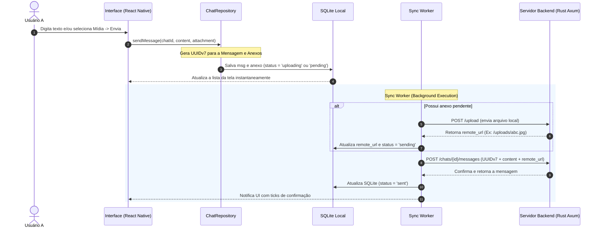

# Arquitetura Offline-First do Zapi v2 (SQLite + Cache + Worker + Repository)

Este documento descreve a arquitetura de dados, sincronização e armazenamento do aplicativo cliente (React Native / Expo) e servidor (Rust Axum), migrados para um modelo **offline-first de alta performance e baixo custo**.

---

## 1. Visão Geral da Arquitetura (V2)

Para garantir máxima performance, desacoplamento e resiliência, a interface do usuário (UI) não se comunica diretamente com a API ou com o SQLite. Em vez disso, adotamos o padrão **Repository** intermediado por um **Sync Worker** em background.

```text
    ┌───────────┐
    │    UI     │
    └─────┬─────┘
          │ (Observa & Dispara)
    ┌─────▼─────┐
    │Repository │
    └─────┬─────┘
          │ (CRUD Síncrono)
    ┌─────▼─────┐         ┌──────────────┐
    │  SQLite   ◄─────────┤ Sync Worker  │
    └───────────┘         └──────┬───────┘
                                 │ (Rede & Retry)
                          ┌──────▼───────┐
                          │   Servidor   │
                          └──────────────┘
```

---

## 2. Estrutura do Banco de Dados Local (SQLite)

O banco de dados local `messages.db` utiliza três tabelas principais, separando mídias das mensagens e adicionando índices para suportar milhões de registros de forma eficiente.

### Tabela `chats`
Armazena a lista de conversas ativas no dispositivo.

| Coluna                 | Tipo      | Descrição                                  |
| :--------------------- | :-------- | :----------------------------------------- |
| `id`                   | TEXT (PK) | UUID único do chat                         |
| `participant_id`       | TEXT      | ID do outro usuário (ou null se for grupo) |
| `participant_username` | TEXT      | Nome do participante                       |
| `is_group`             | INTEGER   | `1` se for grupo, `0` se chat direto       |
| `name`                 | TEXT      | Nome do chat/grupo                         |
| `last_message`         | TEXT      | Conteúdo resumido da última mensagem       |
| `last_message_at`      | TEXT      | Timestamp ISO da última mensagem           |
| `created_at`           | TEXT      | Data de criação                            |
| `unread_count`         | INTEGER   | Quantidade de mensagens não lidas          |
| `is_blocked_by_me`     | INTEGER   | `1` se bloqueado pelo usuário local        |
| `is_blocked_by_them`   | INTEGER   | `1` se bloqueado pelo destinatário         |

### Tabela `messages`
Armazena o histórico do texto e os metadados de sincronização.

| Coluna                 | Tipo      | Descrição                                                         |
| :--------------------- | :-------- | :---------------------------------------------------------------- |
| `id`                   | TEXT (PK) | UUIDv7 (Gerado pelo cliente ou definitivo do servidor)            |
| `chat_id`              | TEXT      | ID da conversa associada (FK)                                     |
| `sender_id`            | TEXT      | ID de quem enviou                                                 |
| `sender_username`      | TEXT      | Username do remetente                                             |
| `content`              | TEXT      | Texto da mensagem (opcional se houver mídia)                      |
| `created_at`           | TEXT      | Timestamp ISO (Time-ordered via UUIDv7)                           |
| `status`               | TEXT      | Estado da fila: `pending`, `uploading`, `sending`, `sent`, `failed` |
| `deleted_for_everyone` | INTEGER   | `1` se a mensagem foi apagada, `0` caso contrário                 |

### Tabela `attachments`
Tabela dedicada para armazenar uma ou mais mídias associadas a uma mensagem.

| Coluna            | Tipo      | Descrição                                                                       |
| :---------------- | :-------- | :------------------------------------------------------------------------------ |
| `id`              | TEXT (PK) | UUIDv7 único do anexo                                                           |
| `message_id`      | TEXT (FK) | ID da mensagem associada (Chave Estrangeira - CASCADE ON DELETE)                 |
| `type`            | TEXT      | Tipo de mídia: `image`, `video`, `audio`, `document`                            |
| `remote_url`      | TEXT      | URL física no servidor remoto                                                   |
| `local_path`      | TEXT      | Caminho físico absoluto no armazenamento do celular                             |
| `mime_type`       | TEXT      | Tipo mime (Ex: `image/jpeg`, `video/mp4`, `audio/opus`)                         |
| `width`           | INTEGER   | Largura da imagem/vídeo (em pixels)                                              |
| `height`          | INTEGER   | Altura da imagem/vídeo (em pixels)                                              |
| `duration`        | INTEGER   | Duração de mídias de áudio/vídeo (em segundos)                                  |
| `size`            | INTEGER   | Tamanho do arquivo físico (em bytes)                                            |
| `sha256`          | TEXT      | Hash SHA-256 para integridade e deduplicação                                    |
| `thumbnail_path`  | TEXT      | Caminho local da miniatura pré-gerada                                           |
| `download_status` | TEXT      | Estado do download local: `pending`, `downloading`, `downloaded`, `failed`      |

---

## 3. Otimizações de Banco de Dados (Índices)

Aplicamos índices estratégicos tanto localmente quanto no backend PostgreSQL para buscas ultrarrápidas:

```sql
-- SQLite & Postgres
CREATE INDEX IF NOT EXISTS idx_messages_chat_id_created_at ON messages(chat_id, created_at);
CREATE INDEX IF NOT EXISTS idx_messages_status ON messages(status);
CREATE INDEX IF NOT EXISTS idx_messages_sender_id ON messages(sender_id);
CREATE INDEX IF NOT EXISTS idx_attachments_message_id ON attachments(message_id);
CREATE INDEX IF NOT EXISTS idx_attachments_download_status ON attachments(download_status);
```

---

## 4. Fluxo de Envio e Sincronização (Background Worker)

O envio de mensagens é 100% assíncrono e utiliza UUIDv7 ordenado no tempo:



---

## 5. As 20 Evoluções Implementadas na Arquitetura

1. **Separação de Mídia e Mensagens**: Mídias agora vivem na tabela `attachments`, permitindo múltiplas mídias por mensagem, legendas integradas e extensões futuras.
2. **Substituição de `image_url`**: Uso genérico de `remote_url` nos anexos, adequando-se para fotos, vídeos, áudios e PDFs.
3. **Sync States Detalhados**: Estados granulares para a fila de transmissão: `pending`, `uploading`, `uploaded`, `sending`, `sent`, `delivered`, `read` e `failed`.
4. **UUIDv7 Gerado no Cliente**: IDs gerados no tempo e ordenados. Melhora eficiência do índice B-Tree do banco e permite ordenação nativa sem depender de timestamps confiáveis.
5. **Paginação Avançada**: Implementação de paginação (LIMIT/OFFSET ou Keyset baseada em UUIDv7) no SQLite para carregar conversas em blocos de 50 mensagens.
6. **Índices de Performance**: Indexação em chaves estrangeiras, status e datas para manter consultas estáveis mesmo com milhões de linhas.
7. **Background Sync Worker**: Desacoplamento da lógica de envio e rede da Thread de UI. O Worker gerencia envios, uploads e retentativas em segundo plano.
8. **Delete TTL no Servidor**: O servidor atua como ponte de entrega. Mensagens confirmadas como recebidas/lidas são limpas após 30 dias (TTL), reduzindo custos de armazenamento no Supabase.
9. **Downloads Inteligentes**: Arquivos pesados (ex: >10MB) mostram metadados e aguardam o clique do usuário para iniciar o download, economizando dados e armazenamento local.
10. **Suporte a Miniaturas**: Criação e mapeamento de `thumbnail_path` para exibir previews leves em listas, baixando o arquivo original apenas quando aberto.
11. **Garantia de Integridade (Hash SHA-256)**: Suporte a hash SHA-256 nos anexos para evitar uploads duplicados (deduplicação no cliente) e validar a integridade física do arquivo.
12. **Mime Type Explicito**: Coluna `mime_type` evita decodificações custosas por extensão e permite abrir visualizadores nativos adequados.
13. **Tamanho Físico (Size)**: Armazenamento em bytes permite mostrar alertas de tamanho (Ex: "Vídeo - 12MB") antes do download.
14. **Largura e Altura Pré-definidas**: Resoluções (`width` e `height`) salvas evitam "saltos" visuais na UI durante a renderização de imagens recebidas.
15. **Duração do Áudio/Vídeo**: Mapeamento de `duration` para carregar players de áudio e vídeo com a barra de progresso populada instantaneamente.
16. **Caminhos Locais Dinâmicos**: Armazenamento de miniaturas e mídias em subpastas estruturadas (`media/images`, `media/videos`, `media/audio`, `media/documents`).
17. **Retentativa Automática**: O Sync Worker escuta conexões de rede e reenvia automaticamente pacotes com status `'failed'`.
18. **Sincronização Incremental (last_sync)**: Sincronizações subsequentes baixam apenas alterações ocorridas após o timestamp local mais recente, reduzindo banda do servidor.
19. **Backup Físico do SQLite + Mídia**: Capacidade de empacotar o banco local e a pasta `/media/` em um ZIP para upload seguro no Google Drive ou iCloud.
20. **Padrão Repository**: Introdução do `ChatRepository.ts` centralizando toda a lógica de dados. A UI apenas observa mudanças e solicita ações ao repositório, garantindo modularidade para testes.
