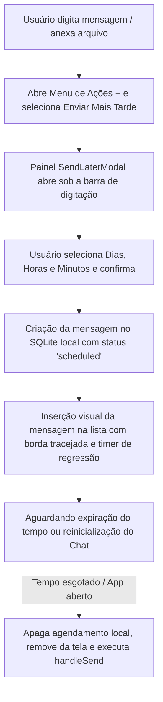

# Documentação: Funcionalidade Enviar Mais Tarde (Send Later)

Esta documentação detalha a arquitetura, o fluxo de execução e a estrutura de dados da funcionalidade **Enviar Mais Tarde** implementada no cliente móvel do Zapi.

---

## 1. Visão Geral da Funcionalidade

A funcionalidade "Enviar Mais Tarde" permite que os usuários agendem o envio de mensagens (textos, imagens, vídeos, arquivos ou áudios) para uma data/hora futura definida de forma manual através de um componente Apple-style de rodízio (Wheel Picker) integrado diretamente no fluxo de chat. 

Para assegurar a robustez da funcionalidade, o agendamento é **persistido localmente no banco de dados SQLite** do aplicativo. Caso o app seja fechado ou reiniciado, os agendamentos pendentes são recarregados na inicialização do chat e reagendados automaticamente.

---

## 2. Fluxo de Execução

### Detalhes das Etapas:
1. **Agendamento Visual**: Ao clicar no botão de confirmar no `SendLaterModal`, o input de texto e os anexos selecionados no chat são limpos da barra de digitação ativa imediatamente para que o usuário continue usando o chat.
2. **Persistência Local**: A mensagem é salva na tabela local `messages` com `status = 'scheduled'` e `scheduled_for = timestamp_futuro_ms`.
3. **Gerenciamento de Timers**:
   - **Caso feliz (App Aberto)**: Um temporizador em memória (`setTimeout`) aguarda a expiração do tempo de agendamento. Ao finalizar, remove o registro `"scheduled"` e dispara o envio definitivo.
   - **Recuperação de Falhas (App Fechado)**: Durante a inicialização da tela de chat, a função `loadMessages` busca todas as mensagens da conversa no SQLite. Se encontrar mensagens com `status = 'scheduled'`:
     - Se o horário agendado já passou (`scheduled_for <= Date.now()`), a mensagem é enviada **imediatamente**.
     - Se o horário agendado for futuro, um novo temporizador é criado para o tempo restante (`scheduled_for - Date.now()`).

---

## 3. Arquitetura de Componentes e Arquivos

### A. [`mobile/services/api.ts`](file:///home/primer/Documents/zapi/mobile/services/api.ts)
* Adicionado status `"scheduled"` no tipo da mensagem.
* Adicionado o campo opcional `scheduled_for?: number` para armazenar o timestamp (em milissegundos) em que o envio deve ocorrer.

### B. [`mobile/services/database.ts`](file:///home/primer/Documents/zapi/mobile/services/database.ts)
* **Upgrade do Banco de Dados**: Adicionada a coluna `scheduled_for INTEGER DEFAULT NULL` na inicialização e atualização da tabela `messages`.
* **Mapper local**: Atualizada a função `getMessagesFromLocal` para preencher a propriedade `scheduled_for` a partir das linhas do SQLite.
* **Inserção de Registro**: Atualizada a função `insertMessageLocal` para suportar o status `"scheduled"` e salvar o campo `scheduled_for`.

### C. [`mobile/components/SendLaterModal.tsx`](file:///home/primer/Documents/zapi/mobile/components/SendLaterModal.tsx)
* Implementa o painel de agendamento Apple-like.
* Utiliza um componente customizado `WheelPicker` baseado em `ScrollView` com `snapToInterval` para permitir a seleção tátil de **Dias**, **Horas** e **Minutos**.
* Renderiza como painel inline sob a barra de entrada principal em vez de um Modal de tela cheia.

### D. [`mobile/components/MessageBubble.tsx`](file:///home/primer/Documents/zapi/mobile/components/MessageBubble.tsx)
* **Diferenciação Estética**: Quando o status é `"scheduled"`, o balão de mensagem exibe uma opacidade de `0.7` e borda tracejada (`borderStyle: "dashed"`).
* **Contagem Regressiva Visual**: Implementa o componente `<ScheduledCountdown>` que atualiza dinamicamente a contagem em tempo real (exemplo: `"Envia em 1h 30m"`, `"Envia em 4m 20s"`, ou `"Enviando..."` quando chega a zero).

### E. [`mobile/hooks/useChat.ts`](file:///home/primer/Documents/zapi/mobile/hooks/useChat.ts)
* **`handleScheduleMessage`**: Nova função que encapsula o fluxo de criação local, salvamento no banco, atualização do estado do React Native e início do timer `setTimeout`.
* **`loadMessages`**: Atualizado para ler o SQLite, identificar mensagens agendadas residuais e reativar suas respectivas rotinas de contagem/envio.

### F. [`mobile/app/chat.tsx`](file:///home/primer/Documents/zapi/mobile/app/chat.tsx)
* Acopla o `<SendLaterModal>` inline abaixo da caixa de texto do chat.
* Ajusta a propriedade `bottom` de posicionamento absoluto da caixa de entrada em tempo real quando o agendador está ativo, empurrando os inputs de texto, anexo e microfone para cima da tela de rodízio de tempo.
